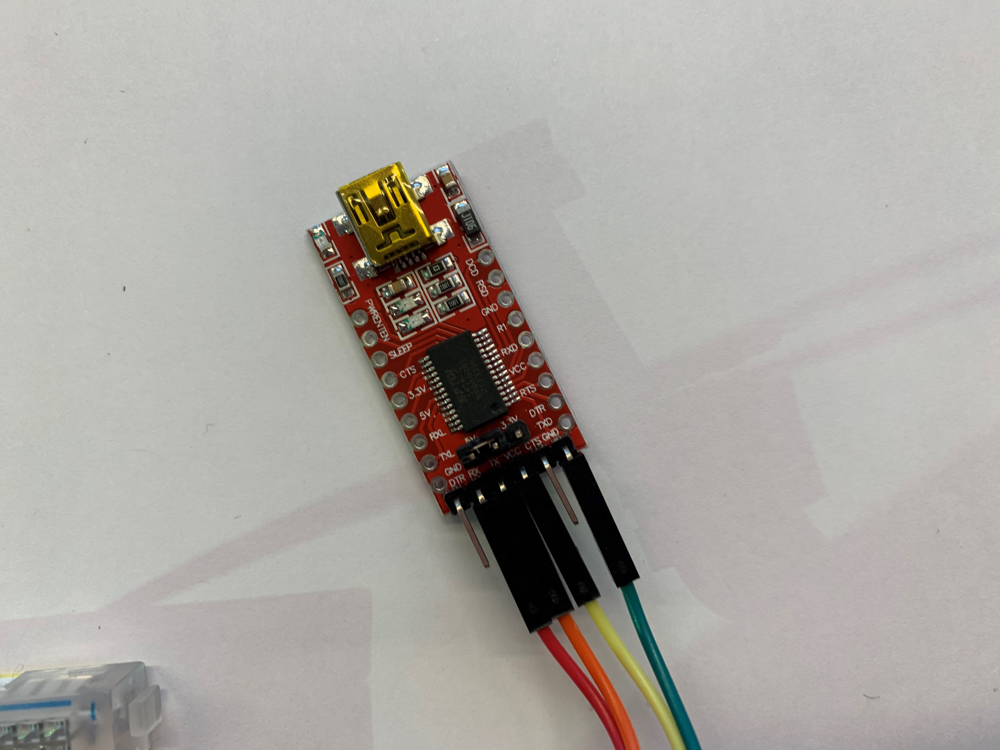
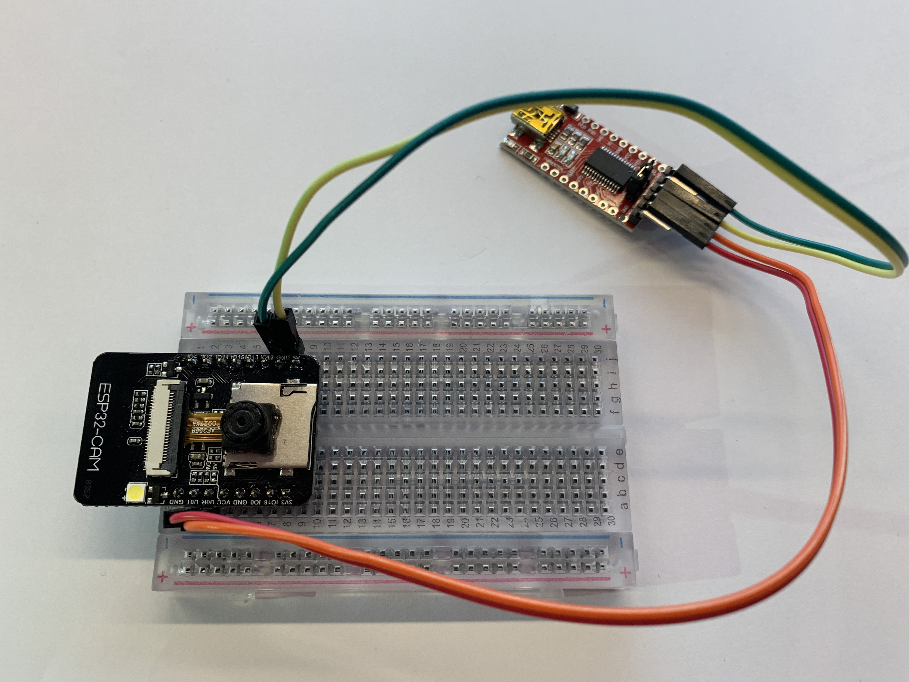
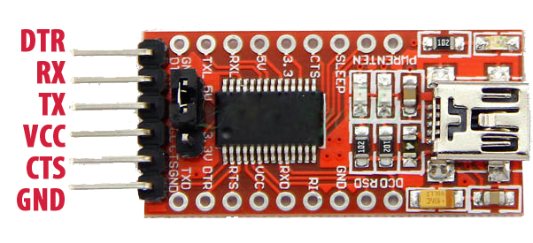
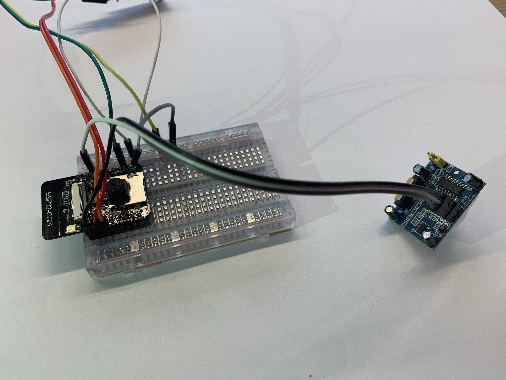
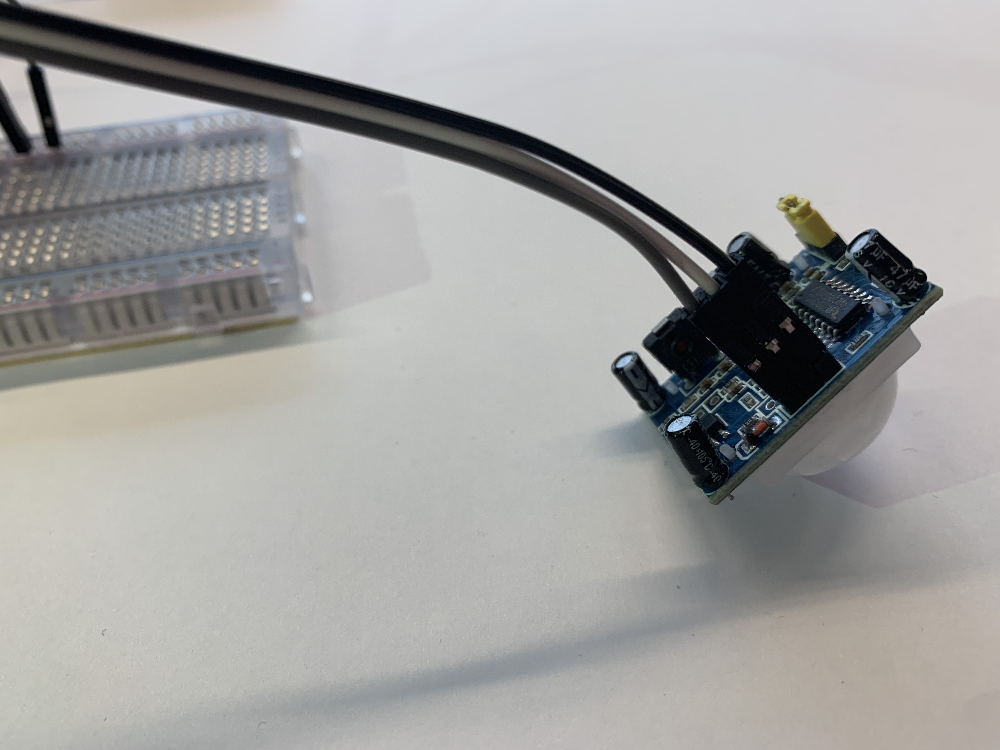
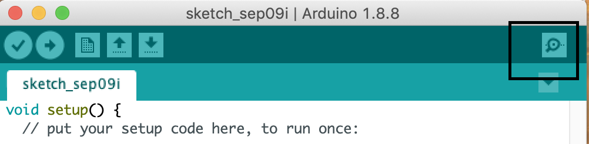
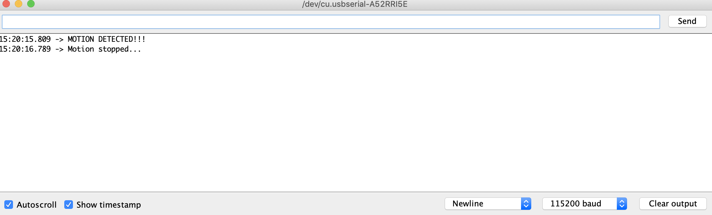
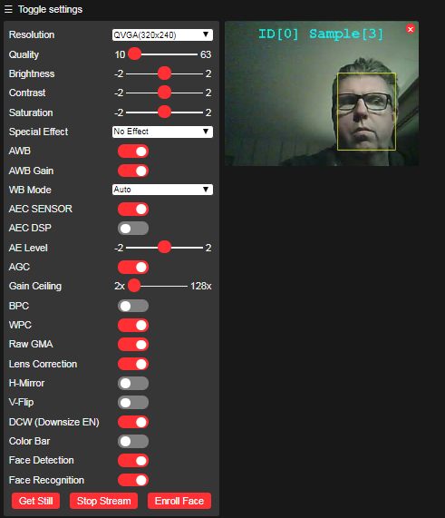

# Build-your-own-security-cam

Workshop details on how to build your own security camera with a ESP32-CAM


## Connect hardware on breadboard








- USBTOTTL pin 5V to ESP pin 5V
- USBTOTTL pin GND to ESP pin GND
- USBTOTTL pin TXD to ESP pin U0R
- USBTOTTL pin RXD to ESP pin U0T


Connect the USBTOTTL with the USB cable to your laptop

## Setup environment

1. Download Arduino IDE from arduino.cc and install it
2. Download the USB to TTL driver from https://www.ftdichip.com/Drivers/VCP.htm
3. Go to 'Device Manager' in Windows and install the driver
4. Open Arduino IDE and go to Preferences
5. Add **https://dl.espressif.com/dl/package_esp32_index.json** to additional Boards manager URLs
6. Go to **Tools** > **Board** > **Boards Manager**
7. Search for ESP32
8. Install it

## Blink!

If you have been following our previous workshop you already now what is coming: blink!

But on the ESP32-CAM it is not just any led blinking; its a flash that you can use later to brighten up the surroundings for the camera.

Go to the GitHub page (github.com/thomasvoorend/innovatos-cam) and download the "InnovatosBlink.ino" folder

Open it in the Arduino IDE and select the 'AiThinker ESP32-CAM' under Tools > Board, and the COM port under Tools > Port

To upload our program to the ESP32-CAM, we have to set it in 'Download' mode, it can be done by connecting a jumper cable to port IO0 and GND, then we have to press the reset button on the ESP32-CAM, unfortunately it is on the bottom.

Click on upload, and wait for the file to upload

After uploading, remove the jumper cable between IO0 and GND, and press the reset button again.

The light should now be flashing


## Test to see if the ESP can detect movement

First, we connect a movement sensor, called a PIR sensor to our ESP board. If you remove the cap from the sensor you see the labels of the pins.

Connect:

GND on the PIR to a GND port on your ESP

OUT on the PIR to IO2 on your ESP

VCC to the 5V port on your ESP,

As you can see, the 5V port is already in use. So you have to place the 5V cable from the USB to TTL converter and the 5V from the PIR to the + line on your breadboard, and place a male to male cable between this line and the 5V port on the ESP.






Go to the GitHub page (github.com/thomasvoorend/innovatos-cam) and download the "InnovatosPir.ino" folder

Open it in the Arduino IDE and select the 'AiThinker ESP32-CAM' under Tools > Board, and the COM port under Tools > Port

To upload our program to the ESP32-CAM, we have to set it in 'Download' mode, it can be done by connecting a jumper cable to port IO0 and GND, then we have to press the reset button on the ESP32-CAM, unfortunately it is on the bottom.

Click on upload, and wait for the file to upload

After uploading, remove the jumper cable between IO0 and GND, and press the reset button again.

**WARNING, the led is now much brighter!!!**

Open the arduino serial monitor at baud rate 115200, move your hand in front of the PIR sensor. The led should turn on and a message will printed in the serial monitor. 




**If the PIR sensor does not measure anything, the sensitivity must be adjusted. This can be done by turning the orange screw on the side a quarter turn.** 


## Say cheese! 

Download the InnovatosCamWebserver folder from our GitHub and open it in the Arduino IDE,

change the following parameters to the Innovatos WiFi, or to your own hotspot:

```
const char* ssid = "<YOUR-WIFI-SSID>";
const char* password = "<WIFI-PASSWORD>";
```

Reconnect the jumper cable between IO0 and GND, and reset the board.

You can now upload the code.

After the upload has finished open 'Serial Monitor' and set the baud rate to 115200,

now remove the jumper cable and reset the ESP32-CAM. You should now see the following in the Serial Monitor:

```
WiFi connected
Starting web server on port: '80'
Starting stream server on port: '81'
Camera Ready! Use 'http://172.20.10.2' to connect
```

Go to that URL (make sure your laptop is in the same network!) and click 'Start Stream'

If you correctly align your face it will enable you to detect, enroll your face and recognize it.



## CHALLENGE!

Now we've made a system with a movement detection and a light, and another system with a camera and face recognition. Can you combine it?

Tip: use the app_httpd.cpp file in the webserver folder
